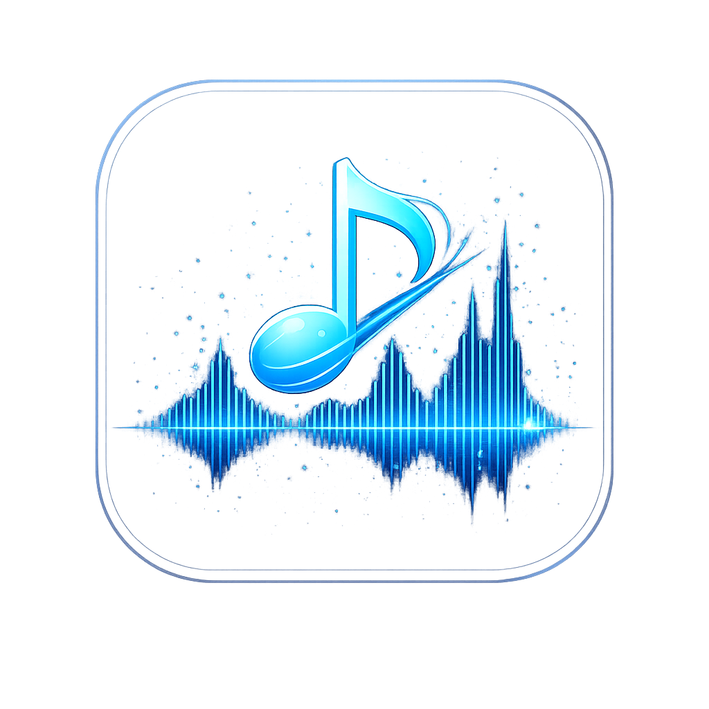
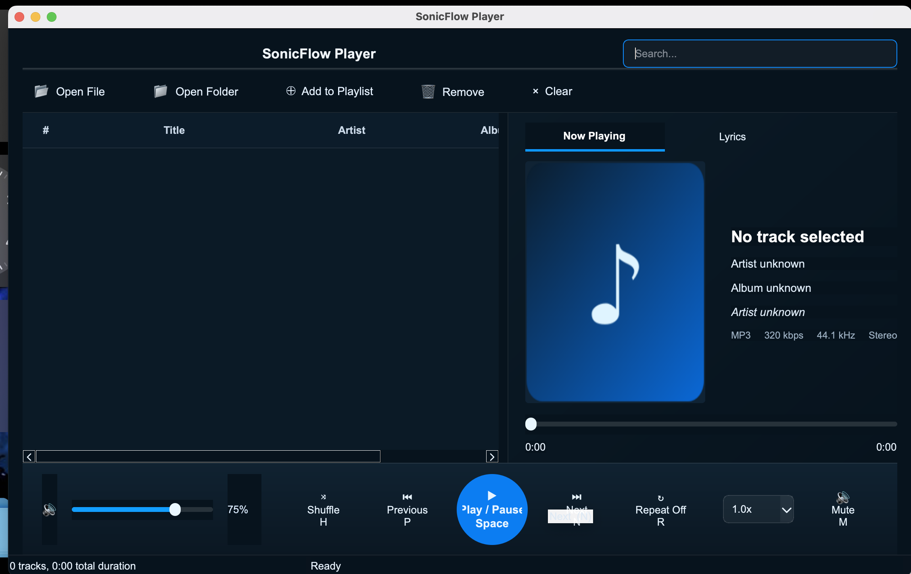
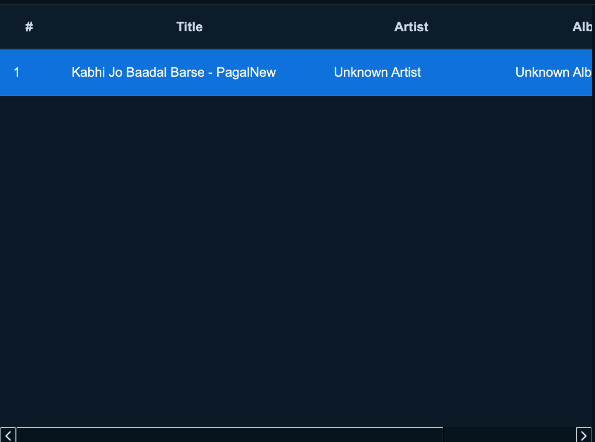
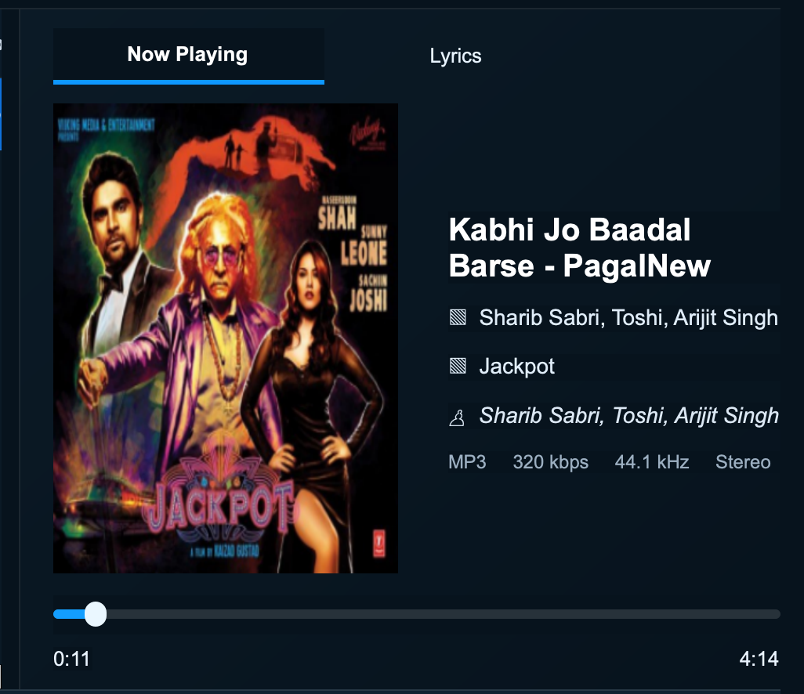

<p align="center">
  
</p>

<h1 align="center">🎵 SonicFlow Player</h1>

<p align="center">
A modern cross-platform desktop audio player built with <b>C++17</b> and <b>Qt 6</b>.
</p>

<p align="center">
  
  
  
  
</p>

---

# ✨ Features

- 🎵 Open Audio Files
- 📂 Open Folder
- 🎵 Playlist Management
- 🖱️ Drag & Drop Support
- ▶️ Play / Pause / Stop
- ⏭️ Next / Previous
- 🔀 Shuffle
- 🔁 Repeat
- 🔊 Volume Control
- 🔇 Mute
- 🖼️ Album Artwork
- 📋 Metadata Display
- ⌨️ Keyboard Shortcuts
- 💾 Save / Load Playlist
- 🌙 Modern Dark Theme
- ⚡ Fast and Lightweight
- 🌍 Cross Platform
- 🚫 No VLC Dependency
- ❤️ Built with Qt Multimedia

---

# 📸 Screenshots

## Main Window



---

## Playlist



---

## Now Playing



---

# ⌨️ Keyboard Shortcuts

| Action | Windows/Linux | macOS |
|----------|--------------|---------|
| Play / Pause | Space | Space |
| Open File | Ctrl+O | Cmd+O |
| Next Track | N | N |
| Previous Track | P | P |
| Volume Up | ↑ | ↑ |
| Volume Down | ↓ | ↓ |
| Seek Forward | → | → |
| Seek Back | ← | ← |
| Mute | M | M |
| Shuffle | H | H |
| Repeat | R | R |
| Quit | Ctrl+Q | Cmd+Q |

---

# 🛠️ Build

## Requirements

- Qt 6
- C++17
- CMake

## Build

```bash
mkdir build
cd build
cmake ..
cmake --build .
```

---

# 🍎 macOS

```bash
open SonicFlowPlayer.app
```

---

# 🪟 Windows

```bash
SonicFlowPlayer.exe
```

---

# 🐧 Linux

```bash
./SonicFlowPlayer
```

---

# 📁 Project Structure

```
SonicFlowPlayer/
│
├── assets/
│   └── app_icon.png
│
├── screenshots/
│   ├── main-window.png
│   ├── playlist.png
│   └── now-playing.png
│
├── MainWindow.cpp
├── MainWindow.h
├── PlayerController.cpp
├── PlayerController.h
├── PlaylistManager.cpp
├── PlaylistManager.h
├── MetadataManager.cpp
├── MetadataManager.h
├── main.cpp
├── resources.qrc
├── CMakeLists.txt
├── README.md
└── LICENSE
```

---

# 🚀 Installation

Clone the repository:

```bash
git clone https://github.com/YOUR_USERNAME/SonicFlowPlayer.git
```

```bash
cd SonicFlowPlayer
```

```bash
mkdir build
cd build
cmake ..
cmake --build .
```

---

# ❤️ Technologies Used

- C++17
- Qt 6
- Qt Widgets
- Qt Multimedia
- CMake

---

# 🌟 Future Improvements

- Smart Play Queue
- Equalizer
- Audio Visualizer
- Lyrics Support
- Theme Customization
- Media Key Support
- Better Notifications

---

# 📄 License

This project is released under the MIT License.

---

<p align="center">
Made with ❤️ by Waqas Abbasi
</p>
